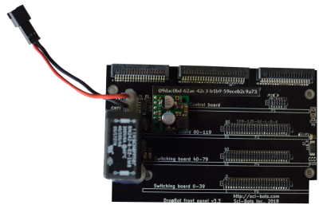

# DropBot v3 front panel

The front panel board provides the power (+3.3V, +12V) and communication (i2c) bus for the other boards in the [DropBot v3 system][dropbot] and routes the high-voltage outputs from the switching boards to the pogo-pin board.

For more information, please visit https://sci-bots.com

[][sci-bots]

This design is open-source hardware released under a [Creative Commons Attribution-ShareAlike licence][cc-by-sa].

[][cc-by-sa]

[dropbot]: https://sci-bots.com/dropbot
[sci-bots]: https://sci-bots.com/
[cc-by-sa]: http://creativecommons.org/licenses/by-sa/3.0

